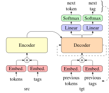

# Tag Assisted Neural Machine Translation



This is the source code for results published in [Siekmeier et al., 2021]().

This repo consists of the following:
- `tagged-seq2seq/` - the main fairseq extensions to be imported with `--user-dir`
   for data binarization, model training, and evaluation
As well as:
- `tagging/` - [Flair](https://github.com/flairNLP/flair)
   tagging scripts to add tags to raw data
- `utilities/` - text preprocessing utilities to prepare datasets

## Getting started

### Initialize dataset

IWSLT'14:
```
$ utilities/prepare_iwslt14.sh src_lang tgt_lang
```

OpenSubtitles:
```
$ pip install opustools
$ utilities/prepare_opensub.sh src_lang tgt_lang
```

These prepare a single data file for tagging.

### Tagging with Flair

See `./tagging/README.md` for more details.

### Preprocessing

Collecting tagged sentences into splits, tokenizing, covering all factors
```
$ pip install -r utilities/requirements.txt
$ utilities/prepare_tagged_splits
```
For OpenSubs, `splits="train,3000000 valid,100000 test,100000"`.

For IWSLT, `splits="train, valid, test, --consecutive"`.

See `./utilities/README.md` for more details.

### Model training and evaluation

Requires CUDA, cuDNN, PyTorch, and [fairseq](https://github.com/pytorch/fairseq) v0.10.2
```
pip install -r requirements.txt
SITEPACKAGES=$(python -c "import fairseq as _; print(_.__path__[0].rsplit('/',1)[0])") &&
patch -d $SITEPACKAGES -p1 < 0001-patch-for-fairseq-v0.10.2-to-apply-in-fairseq-venv-s.patch
```
to install dependencies and required fairseq patches.

Binarization requires these dependencies and code, but no GPU.
```
./binarize.sh dataset
```

_(Requires CUDA-enabled GPU)_ To train and evaluate on a dataset
(e.g. `IWSLT14-unigram32k-notags`, `OpenSub-3m-unigram32k-ner`):
```
export CUDA_VISIBLE_DEVICES=...
./train.sh dataset
./eval.sh
```

Tensorboard logs are written to `logs/dataset`, fairseq-generate output in `results/dataset`.
